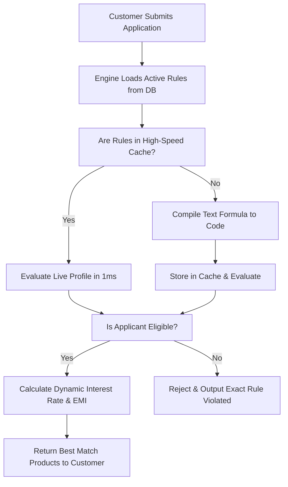

# Client Guide: PRYME Intelligent Eligibility & Business Rules Engine

This document explains in simple, plain English (no technical jargon) how PRYME's **Intelligent Eligibility Engine** works, how you can write loan guidelines, and how those guidelines are instantly applied to reject or approve customers in real-time.

---

## 1. The Core Benefit: No Developers, No Redeployments

Traditionally, if a bank changed its loan criteria (e.g., raised the minimum CIBIL score from 650 to 700), a software developer had to modify the code, build the system, test it, and deploy it to the server. This could take days or weeks.

**With PRYME's Intelligent Rules Engine, this is instant.** 
As soon as you type a new guideline in the **Engine Rules** tab of your Admin Dashboard and click **Save Changes**:
1. The rule is saved in the secure cloud database.
2. The engine instantly detects the change.
3. The very next customer application is automatically checked against your new rule in milliseconds.

---

## 2. The "200 IQ" Smart Interpreter (No-Code to Low-Code)

To make it incredibly easy for non-technical team members, we built a **Smart Interpreter**. The engine acts like a human credit officer reading your typed guidelines. It automatically classifies and executes whatever you type based on four simple tiers:

### 💡 Tier 1: Plain English Memos (No-Code)
If you want to record a guideline that requires a human touch or manual review, simply write it in plain English.
* **Example**: `Must have Indore residence proof` or `Manual verification required for low business vintage`
* **How it works**: The engine recognizes this is a human note. It safely passes the check, saves the memo, and displays it to your operations team without crashing the calculator.

### 📋 Tier 2: Simple Lists (No-Code Deny-Lists)
If you want to exclude specific profiles, you don't need code. Just list them, separated by commas.
* **Example**: `SALARIED, PROFESSIONAL` (typed into the Profile Restrictions column)
* **How it works**: The engine automatically detects the list and instantly blocks any applicant matching those categories.

### 🔢 Tier 3: Simple Math Rules (Low-Code)
If you want to enforce numeric thresholds (CIBIL, Age, Loan Amount), use a simple mathematical comparison. Just prefix your target variables with a `#` symbol:
* **Example 1**: `#cibilScore >= 750` (Applicant's CIBIL must be 750 or higher)
* **Example 2**: `#applicantAge <= 65` (Applicant must be 65 or younger)
* **Example 3**: `#loanAmount < 10000000` (Loan request must be below 1 Crore)
* **How it works**: The engine sees the `#` indicator and the math symbol (`>=`, `<=`, `<`), compiles it instantly in the server's memory, and evaluates it against the live applicant data.

### 🎛️ Tier 4: Advanced Formulas (Formula-Code)
For complex business logic that ties two variables together, prefix your formula with `SPEL:`:
* **Example 1**: `SPEL:#loanAmount <= #propertyValue * 0.85` (Enforces that the loan amount cannot exceed 85% of the property value)
* **Example 2**: `SPEL:#existingEmiTotal + #proposedEmi <= #income * 0.50` (Enforces that all combined EMIs cannot exceed 50% of the applicant's resolved monthly income)
* **How it works**: The engine compiles this as a high-powered mathematical formula for absolute precision.

---

## 3. How the Engine Works Under the Hood

When a customer submits an application:

1. **On-The-Fly Compilation**: The engine reads the raw text rules you typed in the admin portal.
2. **High-Speed Caching**: The first time a rule is read, it compiles it into a high-speed machine format in memory and caches it. Subsequent checks take **less than 1 millisecond**!
3. **Double-Lane Evaluation**: For any bank product, you can configure different lanes (e.g., a *Salaried* lane with 65% LTV, and a *Self-Employed* lane with 45% LTV). The engine evaluates the applicant against the lane that matches their profile.
4. **Smart Rejection Logs**: If a product is rejected, the engine logs the exact rule that was violated (e.g., `CIBIL_TOO_LOW` or `LTV_EXCEEDED`) and displays it to the operations team for perfect transparency.

---

## 4. Why this is 100% Safe: The Sandbox Boundary

Since you can type dynamic formulas directly into the engine, we built a **Strict Security Sandbox** around it. 

Even if someone makes a typo or types a dangerous command, **it is physically impossible to crash the server or steal data**. The engine uses a locked-down execution container that:
* **Reads Only**: It can only read the specific applicant variables (`#cibilScore`, `#loanAmount`, etc.) you pass to it.
* **No Access to Servers**: It cannot run system commands, write files, or interact with other databases.
* **Instant Safety Fallback**: If an invalid formula is typed, the engine catches the error, marks the product as ineligible for safety, and alerts your team without interrupting the rest of the application.
